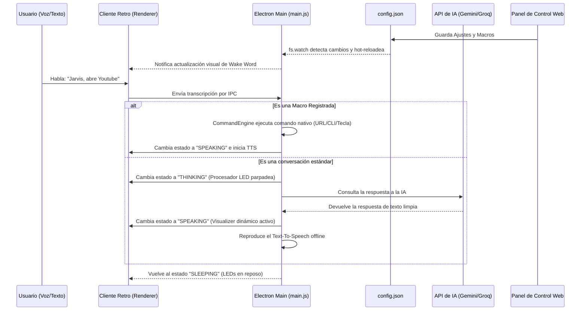

# 📺- Retro Cyberdeck AI Assistant

[](https://nodejs.org/)
[](https://www.electronjs.org/)
[](https://nextjs.org/)
[](https://mui.com/)
[](LICENSE)

Un asistente de escritorio virtual e inteligente con una estética **Skeuomorphic Retro Y2K / CRT-glowing** de alta fidelidad, emparejado con un **Panel de Control Web en Next.js** para la gestión en tiempo real de API Keys (Gemini/Groq), palabras clave de activación por voz (wake words) y un motor de macros de automatización de sistema nativo en Windows.

---

## 📸 Captura Visual & Estética
El cliente de escritorio está diseñado para imitar una consola cyberdeck física de finales de los 90s:
- **Chasis Metálico 3D**: Biseles y tornillos realistas con relieves y sombras convexas/cóncavas.
- **Diodos LED de Estado**: Diodos con brillo radial que cambian dinámicamente (`VERDE` para Micrófono Activo, `NARANJA` para Procesamiento, `APAGADO` para Suspensión).
- **Pantalla CRT de Fósforo**: Rejilla de scanlines horizontales, efecto parpadeo sutil y esquinas redondeadas de tubo catódico.
- **Ecualizador Dinámico**: 10 barras de plasma de neón verde que oscilan con animaciones desfasadas basadas en el estado del habla de Jarvis.
- **Botón de Domo de Vidrio**: Botón esférico verde con refracción de luz para forzar el modo de escucha manualmente.

---

## ⚡ Características Principales

### 🗣️ 1. Reconocimiento de Voz Continuo e Inmune al Eco
- **Web Speech API Integrado**: Procesamiento de transcripción en tiempo real y 100% gratuito directamente dentro del Renderer de Electron.
- **Prevención de Bucles de Eco**: Jarvis desactiva de forma inteligente la escucha del micrófono mientras está procesando o hablando a través del sintetizador de voz, evitando que se escuche a sí mismo y entre en bucles infinitos.
- **Extracción de Comandos Inteligente**: Si dices *"Jarvis, abre Google"* en una sola frase, Jarvis extrae la orden automáticamente de la frase de activación y la procesa de inmediato.

### 🧠 2. Motores Cognitivos Duales (Gemini / Groq)
- **Node.js Native Fetch**: Utiliza el motor nativo de Fetch de Node v24 para comunicarse con las APIs sin requerir pesados módulos SDK de terceros.
- **Personalidad Integrada**: Respuestas con una personalidad retro-cybernetic Y2K personalizada, con filtrado inteligente de sintaxis Markdown para lecturas de voz ultra limpias.

### ⌨️ 3. Motor de Macros de Automatización en Windows
Jarvis intercepta tus comandos de voz configurados y ejecuta acciones del sistema al instante sin necesidad de pasar por la IA:
- **`open_url`**: Abre cualquier enlace o protocolo (como enlaces nativos `discord://` para llamar a amigos) en tu navegador predeterminado.
- **`cli_command`**: Ejecuta scripts, inicia programas de Windows y comandos de consola en segundo plano.
- **`keystroke`**: Genera pulsaciones y atajos del teclado físicos (como `Ctrl+Shift+I` o `Alt+Tab`) mediante un subproceso ligero en PowerShell nativo de Windows, **sin requerir la compilación de módulos C++ nativos en Node**.

---

## 🏗️ Arquitectura de Flujo



---

## 🛠️ Instalación y Puesta en Marcha

### Requisitos Previos
- **Sistema Operativo**: Windows (idealmente) para el soporte completo de las macros de teclado nativas.
- **Node.js**: v24.15.0 o superior
- **npm**: 11.12.1 o superior

### 1. Clonar el repositorio e instalar dependencias
```bash
git clone https://github.com/mgarcia333/cyberdeck.git
cd cyberdeck

# Instalar dependencias del Dashboard Next.js
cd dashboard
npm install

# Instalar dependencias del Cliente Electron
cd ../assistant
npm install
```

### 2. Configurar el entorno
Copia la plantilla de configuración en la raíz del repositorio:
```bash
cd ..
copy config.example.json config.json
```

---

## 🚀 Inicio Rápido (Doble Clic)

Hemos creado un archivo de inicio rápido por lotes de Windows para que no tengas que usar la consola.
1. Ve a la carpeta raíz de tu proyecto (`c:\Users\Practicas\Desktop\jarvi\`).
2. Haz doble clic en el archivo **`start.bat`**.

Esto iniciará concurrentemente:
- **El Panel de Control Web** en **[http://localhost:3000](http://localhost:3000)**.
- **El Cliente de Escritorio Jarvis** flotando en tu pantalla.

---

## 🛠️ Panel de Control (Dashboard)

El Dashboard está construido con Next.js y Material UI, ofreciendo:
- **Selector de Voz TTS**: Carga dinámicamente las voces instaladas en tu sistema operativo (Microsoft David, Zira, Hazel, etc.).
- **Gestor de LLM**: Cambia de proveedor entre Gemini y Groq, introduce tu API Key (ocultable con botón de ojo) de forma segura en local.
- **Constructor de Macros**: Añade, edita y elimina disparadores por voz y sus correspondientes comandos de ejecución con una tabla reactiva fluida.

---

## 📄 Licencia

Este proyecto está bajo la licencia MIT. Consulta el archivo `LICENSE` para más detalles.

---

<p align="center">
 Desarrollado con por @mgarcia333
</p>
